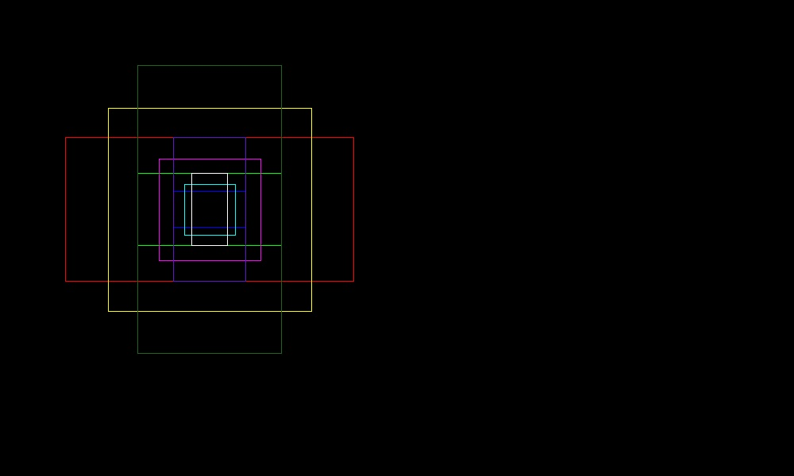
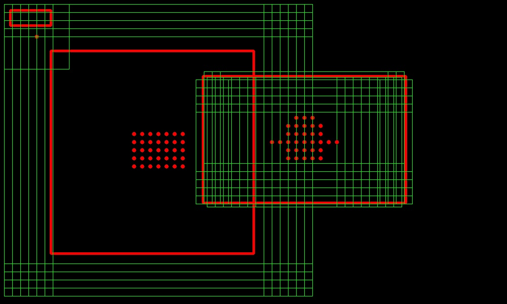

# Faster R-CNN   
In fact, this is a more simplified version of [simple-faster-rcnn-pytorch](https://github.com/chenyuntc/simple-faster-rcnn-pytorch).   

#### Improvements:   
* use pytorch functions instead of numpy functions to generate anchors and targets. Be especially careful with these two functions: ```meshgrid``` ``` where``` because they perform in different way in pytorch and numpy.  
* clearer logic.  

#### TO DO  
- [ ] complete roi pooling  
- [ ] add Resnet as backbone  
- [ ] complete train and evaluate pipeline  

#### Anchors Mechanism  
```  
ratios=(0.5,1.0,2.0) scales=(4.,8.,16.) base_size=16 stride=32  
```  
to show the generated anchor box more clearly, only one set of base anchors is drawed.   
  
```  
ratios=(0.5,1.0,2.0) scales=(8.,16.,32.) base_size=16 stride=16  pos_iou_threshold=0.5
```  
the green boxes are matched anchor boxes. 


#### Model Architecture  
for vgg16 as backbone, the architecture is shown in the figure below.  
   
